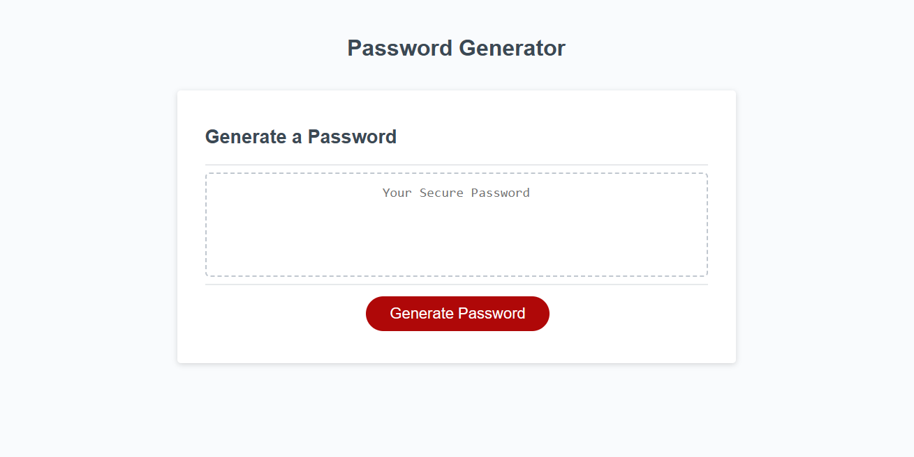

# <Project-Portfolio>

## Description

This is a random password generator. Upon the click of a button, it gives users the ability to choose the length of the password, and what characters they would like to be included in their password. It then generates a random string of characters and abides by the users chosen parameters. I worked on this project to further my understanding of JavaScript. 

## Installation

All you need to do is pull the code down from the repository, open it in your IDE of choice, and run it in a browser.

## Usage

This is meant to give users a secure password with the click of a button.

## Credits

I learned pretty much everything from the head instructor and the TA's from the bootcamp I am 
currently enrolled in. I also bounced some ideas off of a friend of mine while working on this project, so shoutout to my man Isiah. I also did not create the HTML or CSS for this project. That was given from class as starter code. I only created the JavaScript.

## License

MIT License

Copyright (c) [year] [fullname]

Permission is hereby granted, free of charge, to any person obtaining a copy
of this software and associated documentation files (the "Software"), to deal
in the Software without restriction, including without limitation the rights
to use, copy, modify, merge, publish, distribute, sublicense, and/or sell
copies of the Software, and to permit persons to whom the Software is
furnished to do so, subject to the following conditions:

The above copyright notice and this permission notice shall be included in all
copies or substantial portions of the Software.

THE SOFTWARE IS PROVIDED "AS IS", WITHOUT WARRANTY OF ANY KIND, EXPRESS OR
IMPLIED, INCLUDING BUT NOT LIMITED TO THE WARRANTIES OF MERCHANTABILITY,
FITNESS FOR A PARTICULAR PURPOSE AND NONINFRINGEMENT. IN NO EVENT SHALL THE
AUTHORS OR COPYRIGHT HOLDERS BE LIABLE FOR ANY CLAIM, DAMAGES OR OTHER
LIABILITY, WHETHER IN AN ACTION OF CONTRACT, TORT OR OTHERWISE, ARISING FROM,
OUT OF OR IN CONNECTION WITH THE SOFTWARE OR THE USE OR OTHER DEALINGS IN THE
SOFTWARE.

